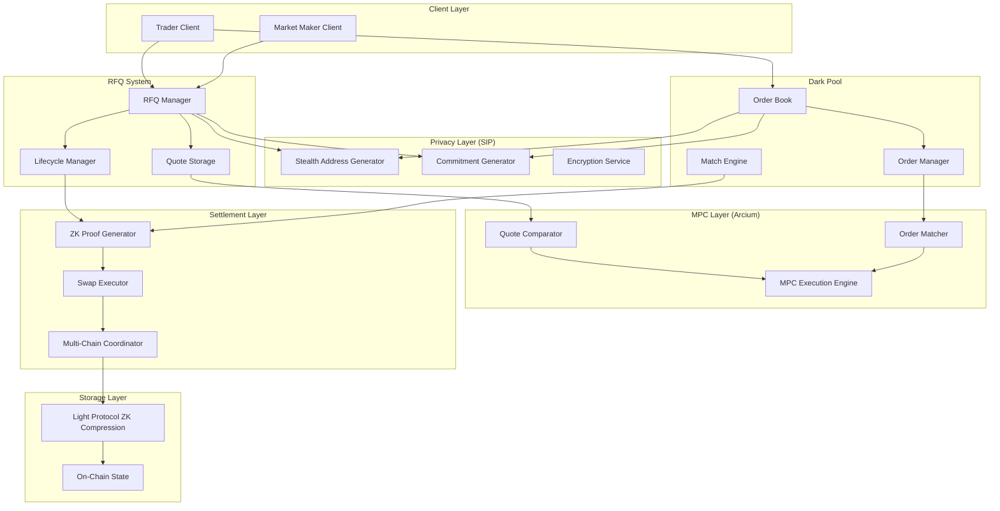

# Design Document: Dark OTC RFQ and Dark DEX

## Overview

The Dark OTC RFQ and Dark DEX system provides privacy-preserving trading infrastructure for the Obscura blockchain. It combines Request For Quotes (RFQ) for large OTC trades with a dark pool order book for continuous trading, both leveraging Arcium MPC for confidential computation, Light Protocol ZK Compression for efficient storage, and WOTS+ signatures for post-quantum security.

### Key Design Goals

1. **Maximum Privacy**: Trade details (price, size, identity) remain hidden from all parties except those directly involved
2. **Post-Quantum Security**: All signatures use WOTS+ to resist quantum computer attacks
3. **Gas Efficiency**: Heavy computation happens off-chain; on-chain operations use ZK Compression
4. **Multi-Chain Support**: Seamless operation across EVM and Solana chains
5. **Regulatory Compliance**: Optional viewing keys for authorized auditors in COMPLIANT mode

### Architecture Philosophy

- **MPC-First**: All sensitive operations (quote comparison, order matching) happen in Arcium secure enclaves
- **Zero-Knowledge Settlement**: On-chain settlement uses ZK proofs to validate trades without revealing details
- **Commitment-Based Privacy**: All public data consists of cryptographic commitments, not plaintext values
- **Off-Chain Heavy Lifting**: Signature verification, matching logic, and validation happen off-chain

## Architecture

### System Components



### Component Responsibilities

#### RFQ Manager
- Accepts quote requests from traders
- Generates stealth addresses for quote responses
- Manages quote request lifecycle (OPEN → EXPIRED/FILLED/CANCELLED)
- Coordinates with MPC layer for quote selection
- Validates WOTS+ signatures on all requests

#### Quote Storage
- Stores encrypted quote responses
- Maintains commitments to quote parameters
- Provides quotes to MPC engine for comparison
- Enforces expiration policies

#### Dark Pool Order Book
- Accepts encrypted orders from traders
- Stores orders using ZK Compression
- Maintains commitments to order parameters
- Enforces time-based expiration

#### Match Engine
- Coordinates with MPC layer for order matching
- Implements price-time priority
- Generates match notifications
- Handles partial fills

#### MPC Layer (Arcium)
- **Quote Comparator**: Decrypts quotes in secure enclave, selects best quote
- **Order Matcher**: Decrypts orders in secure enclave, finds compatible matches
- **MXE**: Executes confidential computations using multi-party computation

#### Settlement Layer
- **ZK Proof Generator**: Creates zero-knowledge proofs of valid trades
- **Swap Executor**: Executes actual asset transfers (integrates with existing SwapExecutor)
- **Multi-Chain Coordinator**: Handles atomic cross-chain settlements

#### Storage Layer
- **Light Protocol**: Provides ZK Compression for efficient on-chain storage (~1000x cheaper)
- **On-Chain State**: Minimal state for commitments and replay protection

## Components and Interfaces

### RFQ Manager Interface

```typescript
interface RFQManager {
  // Create a new quote request
  createQuoteRequest(params: QuoteRequestParams): Promise<QuoteRequestId>;
  
  // Submit a quote response (market maker)
  submitQuote(requestId: QuoteRequestId, quote: EncryptedQuote): Promise<QuoteId>;
  
  // Select best quote using MPC
  selectBestQuote(requestId: QuoteRequestId): Promise<SelectedQuote>;
  
  // Cancel a quote request
  cancelRequest(requestId: QuoteRequestId, signature: WOTSSignature): Promise<void>;
  
  // Get quote request status
  getRequestStatus(requestId: QuoteRequestId): Promise<RFQStatus>;
}

interface QuoteRequestParams {
  baseAsset: AssetId;
  quoteAsset: AssetId;
  side: 'BUY' | 'SELL';
  size: bigint;
  privacyLevel: PrivacyLevel;
  expirationTime: number;
  stealthAddress: StealthAddress;
  commitment: Commitment;
  signature: WOTSSignature;
}

interface EncryptedQuote {
  requestId: QuoteRequestId;
  encryptedPrice: Uint8Array;  // Encrypted with requester's stealth address
  encryptedSize: Uint8Array;
  priceCommitment: Commitment;
  sizeCommitment: Commitment;
  marketMakerAddress: StealthAddress;
  signature: WOTSSignature;
  expirationTime: number;
}

type RFQStatus = 'OPEN' | 'EXPIRED' | 'FILLED' | 'CANCELLED';
```

### Dark Pool Interface

```typescript
interface DarkPool {
  // Submit a new order
  submitOrder(order: EncryptedOrder): Promise<OrderId>;
  
  // Cancel an existing order
  cancelOrder(orderId: OrderId, signature: WOTSSignature): Promise<void>;
  
  // Modify an order (cancel + resubmit)
  modifyOrder(orderId: OrderId, newOrder: EncryptedOrder, signature: WOTSSignature): Promise<OrderId>;
  
  // Get order status
  getOrderStatus(orderId: OrderId): Promise<OrderStatus>;
  
  // Trigger matching engine
  runMatching(): Promise<Match[]>;
}

interface EncryptedOrder {
  baseAsset: AssetId;
  quoteAsset: AssetId;
  side: 'BUY' | 'SELL';
  orderType: 'LIMIT' | 'MARKET';
  encryptedPrice: Uint8Array;  // Encrypted with Arcium cSPL
  encryptedSize: Uint8Array;
  priceCommitment: Commitment;
  sizeCommitment: Commitment;
  traderAddress: StealthAddress;
  signature: WOTSSignature;
  expirationTime?: number;
  privacyLevel: PrivacyLevel;
}

interface OrderStatus {
  orderId: OrderId;
  status: 'OPEN' | 'PARTIALLY_FILLED' | 'FILLED' | 'CANCELLED' | 'EXPIRED';
  remainingSize?: bigint;  // Only visible to order owner
}

interface Match {
  buyOrderId: OrderId;
  sellOrderId: OrderId;
  matchedSize: bigint;
  matchedPrice: bigint;
  zkProof: ZKProof;
  timestamp: number;
}
```

### MPC Engine Interface

```typescript
interface MPCEngine {
  // Compare quotes and select best one
  compareQuotes(quotes: EncryptedQuote[]): Promise<BestQuoteResult>;
  
  // Match orders in the dark pool
  matchOrders(orders: EncryptedOrder[]): Promise<Match[]>;
  
  // Generate viewing keys for compliance
  generateViewingKey(tradeId: TradeId, authorizedParty: PublicKey): Promise<ViewingKey>;
}

interface BestQuoteResult {
  winningQuoteId: QuoteId;
  encryptedDetails: Uint8Array;  // Only requester can decrypt
  commitment: Commitment;
}
```

### Settlement Interface

```typescript
interface SettlementLayer {
  // Settle an RFQ trade
  settleRFQ(
    requestId: QuoteRequestId,
    quoteId: QuoteId,
    zkProof: ZKProof
  ): Promise<SettlementResult>;
  
  // Settle a dark pool match
  settleMatch(match: Match): Promise<SettlementResult>;
  
  // Settle cross-chain trade
  settleCrossChain(
    trade: Trade,
    sourceChain: ChainId,
    destChain: ChainId
  ): Promise<SettlementResult>;
}

interface SettlementResult {
  txHash: string;
  chainId: ChainId;
  gasUsed: bigint;
  compressionSavings?: bigint;  // For Solana with ZK Compression
  viewingKey?: ViewingKey;  // For COMPLIANT mode
}
```

## Data Models

### Quote Request

```typescript
interface QuoteRequest {
  id: QuoteRequestId;
  baseAsset: AssetId;
  quoteAsset: AssetId;
  side: 'BUY' | 'SELL';
  
  // Encrypted parameters
  encryptedSize: Uint8Array;
  
  // Public commitments
  sizeCommitment: Commitment;
  
  // Privacy and identity
  requesterStealthAddress: StealthAddress;
  responseStealthAddress: StealthAddress;  // For receiving quotes
  privacyLevel: PrivacyLevel;
  
  // Lifecycle
  status: RFQStatus;
  createdAt: number;
  expirationTime: number;
  
  // Security
  signature: WOTSSignature;
  nonce: Uint8Array;  // Replay protection
}
```

### Quote Response

```typescript
interface QuoteResponse {
  id: QuoteId;
  requestId: QuoteRequestId;
  
  // Encrypted parameters
  encryptedPrice: Uint8Array;
  encryptedSize: Uint8Array;
  
  // Public commitments
  priceCommitment: Commitment;
  sizeCommitment: Commitment;
  
  // Identity
  marketMakerStealthAddress: StealthAddress;
  
  // Lifecycle
  submittedAt: number;
  expirationTime: number;
  
  // Security
  signature: WOTSSignature;
  nonce: Uint8Array;
}
```

### Dark Pool Order

```typescript
interface Order {
  id: OrderId;
  baseAsset: AssetId;
  quoteAsset: AssetId;
  side: 'BUY' | 'SELL';
  orderType: 'LIMIT' | 'MARKET';
  
  // Encrypted parameters
  encryptedPrice: Uint8Array;
  encryptedSize: Uint8Array;
  
  // Public commitments
  priceCommitment: Commitment;
  sizeCommitment: Commitment;
  identityCommitment: Commitment;  // Commitment to trader identity
  
  // Privacy
  traderStealthAddress: StealthAddress;
  privacyLevel: PrivacyLevel;
  
  // Lifecycle
  status: OrderStatus;
  createdAt: number;
  expirationTime?: number;
  filledSize: bigint;
  remainingSize: bigint;
  
  // Security
  signature: WOTSSignature;
  nonce: Uint8Array;
  
  // Storage optimization
  compressionProof?: ZKCompressionProof;  // For Solana
}
```

### Trade Record

```typescript
interface Trade {
  id: TradeId;
  type: 'RFQ' | 'DARK_POOL';
  
  // Assets
  baseAsset: AssetId;
  quoteAsset: AssetId;
  
  // Commitments (public)
  priceCommitment: Commitment;
  sizeCommitment: Commitment;
  buyerCommitment: Commitment;
  sellerCommitment: Commitment;
  
  // Settlement
  zkProof: ZKProof;
  settlementTxHash: string;
  chainId: ChainId;
  
  // Privacy
  privacyLevel: PrivacyLevel;
  viewingKey?: ViewingKey;  // For COMPLIANT mode
  
  // Metadata
  timestamp: number;
  gasUsed: bigint;
}
```

### Privacy Level

```typescript
enum PrivacyLevel {
  TRANSPARENT = 'TRANSPARENT',  // All details visible (debugging)
  SHIELDED = 'SHIELDED',        // Maximum privacy
  COMPLIANT = 'COMPLIANT'        // Encrypted with viewing keys
}
```

### Commitment Scheme

```typescript
interface Commitment {
  value: Uint8Array;  // Pedersen commitment
  blindingFactor: Uint8Array;  // Only known to committer
}

interface CommitmentProof {
  commitment: Commitment;
  zkProof: ZKProof;  // Proves commitment is well-formed
}
```

## Correctness Properties

*A property is a characteristic or behavior that should hold true across all valid executions of a system—essentially, a formal statement about what the system should do. Properties serve as the bridge between human-readable specifications and machine-verifiable correctness guarantees.*


### Property Reflection

After analyzing all 75 acceptance criteria, I've identified several areas of redundancy that can be consolidated:

**Encryption Properties (1.1, 2.1, 4.1)**: All test that data is encrypted correctly. Can be combined into a single comprehensive encryption property.

**Commitment Generation (1.3, 2.5, 4.2, 6.4)**: All test that commitments are generated correctly. Can be combined into a single commitment property.

**Signature Validation (2.2, 8.1, 11.1, 13.3)**: All test WOTS signature validation. Can be combined into a single signature property.

**Privacy Level Conditionals (1.5, 3.5, 4.5, 6.5, 9.1, 9.5, 14.4)**: All test conditional behavior based on privacy level. Can be combined into fewer comprehensive privacy properties.

**Expiration Handling (1.4, 2.4, 4.4, 11.5, 12.3)**: All test expiration behavior. Can be combined into a single expiration property.

**Status Transitions (12.1, 12.3, 12.4, 12.5)**: All test lifecycle status changes. Can be combined into a single state machine property.

**Chain Routing (7.1, 7.2, 7.4)**: All test chain-specific behavior. Can be combined into a single chain routing property.

**Integration Properties (15.1-15.5)**: All test integration with existing components. Can be combined into fewer integration properties.

**Metrics Emission (14.1, 14.2, 14.3)**: All test metrics emission. Can be combined into a single metrics property.

**Error Handling (13.1-13.5)**: All test error recovery. Can be combined into fewer error handling properties.

After reflection, I'll write consolidated properties that provide unique validation value without redundancy.

### Core Properties

**Property 1: Encryption Correctness**
*For any* quote request, quote response, or order, when encrypted data is created, the encrypted data SHALL be decryptable only by the intended recipient using their private key, and SHALL not be decryptable by any other party.
**Validates: Requirements 1.1, 2.1, 4.1**

**Property 2: Commitment Binding**
*For any* commitment to a value (price, size, identity), the commitment SHALL cryptographically bind to that specific value such that it is computationally infeasible to find a different value with the same commitment.
**Validates: Requirements 1.3, 2.5, 4.2, 6.4, 8.4**

**Property 3: Signature Authenticity**
*For any* signed message (quote request, quote response, order, cancellation), the WOTS signature SHALL verify successfully if and only if it was created by the holder of the corresponding private key.
**Validates: Requirements 2.2, 8.1, 11.1, 13.3**

**Property 4: Unique Identifier Generation**
*For any* set of quote requests or orders created within the system, all identifiers SHALL be unique such that no two distinct requests or orders share the same identifier.
**Validates: Requirements 1.2**

**Property 5: Broadcast Privacy**
*For any* quote request broadcast, the broadcast message SHALL contain only commitments to trade parameters and SHALL NOT contain plaintext values of price, size, or trader identity (except in TRANSPARENT mode).
**Validates: Requirements 1.3**

**Property 6: Expiration Enforcement**
*For any* quote request or order with an expiration time, after the expiration time has passed, the system SHALL reject any new interactions with that request or order (new quotes, matching attempts) and SHALL mark it as expired.
**Validates: Requirements 1.4, 2.4, 4.4, 11.5, 12.3**

**Property 7: Privacy Level Compliance**
*For any* trade with privacy level TRANSPARENT, plaintext details SHALL be included; for SHIELDED, no plaintext SHALL be included; for COMPLIANT, encrypted details with viewing keys SHALL be included.
**Validates: Requirements 1.5, 3.5, 4.5, 6.5, 9.1, 9.5, 14.4**

**Property 8: Storage Encryption Preservation**
*For any* set of encrypted quotes or orders stored in the system, the stored data SHALL remain in encrypted form and SHALL NOT be decrypted during storage operations.
**Validates: Requirements 2.3**

**Property 9: Quote Selection Optimality**
*For any* set of valid quote responses, when the MPC engine selects the best quote, the selected quote SHALL have the most favorable price (lowest for buy, highest for sell) among all valid quotes, with ties broken by earliest submission time.
**Validates: Requirements 3.2**

**Property 10: Quote Selection Privacy**
*For any* quote selection operation, the result SHALL contain only the winning quote identifier and encrypted details, and SHALL NOT reveal the prices or details of non-winning quotes.
**Validates: Requirements 3.3**

**Property 11: Winner Notification**
*For any* completed quote selection or order match, the system SHALL send a notification to the winning party's stealth address within a bounded time period.
**Validates: Requirements 3.4, 12.2**

**Property 12: ZK Compression Usage**
*For any* data stored on Solana (orders, settlement records), the system SHALL use ZK Compression such that the on-chain storage cost is reduced compared to uncompressed storage.
**Validates: Requirements 4.3, 6.2, 10.1**

**Property 13: Order Matching Correctness**
*For any* pair of orders (buy and sell), they SHALL be matched if and only if: (1) they are for the same asset pair, (2) the buy price is greater than or equal to the sell price, (3) both orders have sufficient remaining size, and (4) neither order has expired.
**Validates: Requirements 5.2**

**Property 14: Match Privacy**
*For any* matched trade, the generated ZK proof SHALL verify the validity of the match (price compatibility, size availability) without revealing the individual order prices, sizes, or trader identities.
**Validates: Requirements 5.3, 6.1**

**Property 15: Price-Time Priority**
*For any* order in the dark pool, when multiple compatible counterparty orders exist, the order with the best price SHALL be matched first, and among orders with equal price, the earliest submitted order SHALL be matched first.
**Validates: Requirements 5.4**

**Property 16: No-Match Preservation**
*For any* order that has no compatible counterparty, the order SHALL remain in the order pool with unchanged status and SHALL be available for future matching attempts.
**Validates: Requirements 5.5**

**Property 17: Settlement Stealth Addressing**
*For any* asset transfer during settlement, the recipient address SHALL be a stealth address such that the recipient's identity cannot be determined by observing the blockchain without knowledge of the recipient's private viewing key.
**Validates: Requirements 6.3**

**Property 18: Chain Routing Correctness**
*For any* trade specifying a target chain, the settlement SHALL use the correct chain-specific contract (EVM settlement contract for EVM chains, Anchor program for Solana) and SHALL use chain-specific features (ZK Compression on Solana, standard storage on EVM).
**Validates: Requirements 7.1, 7.2, 7.4**

**Property 19: Cross-Chain Atomicity**
*For any* cross-chain trade, either both chains SHALL complete settlement successfully, or both chains SHALL revert to their pre-trade state, with no intermediate state where only one chain has settled.
**Validates: Requirements 7.3, 7.5, 13.5**

**Property 20: Off-Chain Signature Verification**
*For any* WOTS signature verification, the verification computation SHALL occur off-chain (not in an on-chain transaction) to avoid excessive gas costs.
**Validates: Requirements 8.2**

**Property 21: Quantum-Resistant Cryptography**
*For any* cryptographic operation (key generation, commitment creation, encryption), the system SHALL use algorithms that are resistant to quantum computer attacks (WOTS+ for signatures, hash-based commitments, post-quantum encryption where available).
**Validates: Requirements 8.3, 8.4, 8.5**

**Property 22: Viewing Key Isolation**
*For any* viewing key generated for a trade, the viewing key SHALL decrypt only that specific trade's details and SHALL NOT decrypt any other trade's details.
**Validates: Requirements 9.2, 9.3**

**Property 23: Viewing Key Validation**
*For any* attempt to use a viewing key, the system SHALL validate the viewing key's authenticity and association with the requested trade before performing decryption, and SHALL reject invalid or mismatched viewing keys.
**Validates: Requirements 9.4**

**Property 24: Settlement Batching**
*For any* set of multiple pending settlements that can be batched, the system SHALL aggregate them into a single transaction when doing so reduces total gas costs compared to individual transactions.
**Validates: Requirements 10.2**

**Property 25: Priority Fee Usage**
*For any* transaction marked as high priority, the system SHALL use Helius priority fees to increase the likelihood of faster confirmation compared to standard fee transactions.
**Validates: Requirements 10.3**

**Property 26: Gas Estimation Accuracy**
*For any* trade submission, the pre-submission gas estimate SHALL be within 20% of the actual gas cost of the executed transaction under normal network conditions.
**Validates: Requirements 10.4**

**Property 27: Off-Chain Computation**
*For any* on-chain transaction, the transaction SHALL contain only cryptographic proofs, commitments, and minimal state updates, and SHALL NOT contain heavy computational logic (signature verification, matching logic, encryption/decryption).
**Validates: Requirements 10.5**

**Property 28: Cancellation Authorization**
*For any* order cancellation request, the cancellation SHALL succeed if and only if the request includes a valid WOTS signature from the order's original creator.
**Validates: Requirements 11.1**

**Property 29: Immediate Cancellation Effect**
*For any* successfully cancelled order, the order SHALL be removed from the matching pool such that it is not included in any matching operations that begin after the cancellation completes.
**Validates: Requirements 11.2**

**Property 30: Modification Semantics**
*For any* order modification, the system SHALL cancel the original order (assigning it CANCELLED status) and create a new order with a new identifier, such that the modification is equivalent to a cancel-then-create sequence.
**Validates: Requirements 11.3**

**Property 31: Partial Fill Updates**
*For any* order that is partially filled, the order's remaining size SHALL be updated to reflect the filled amount, and the order SHALL remain in the matching pool with its updated size available for future matches.
**Validates: Requirements 11.4**

**Property 32: Lifecycle State Machine**
*For any* quote request, the status SHALL transition according to the valid state machine: OPEN → {EXPIRED, FILLED, CANCELLED}, where OPEN is the initial state, and terminal states {EXPIRED, FILLED, CANCELLED} cannot transition to other states.
**Validates: Requirements 12.1, 12.3, 12.4, 12.5**

**Property 33: Terminal State Rejection**
*For any* quote request in a terminal state (EXPIRED, FILLED, CANCELLED), the system SHALL reject any new quote submissions for that request.
**Validates: Requirements 12.5**

**Property 34: MPC Failure Recovery**
*For any* MPC computation failure during quote selection or order matching, all affected quotes or orders SHALL remain in their encrypted pool in their pre-computation state, and affected parties SHALL be notified of the failure.
**Validates: Requirements 13.1**

**Property 35: Settlement Failure Rollback**
*For any* settlement failure after a match has been created, the match SHALL be reverted, and the involved orders SHALL be returned to the order pool with their original remaining sizes.
**Validates: Requirements 13.2**

**Property 36: Proof Generation Failure Handling**
*For any* ZK proof generation failure, the settlement process SHALL abort before submitting any on-chain transaction, and affected parties SHALL be notified of the failure.
**Validates: Requirements 13.4**

**Property 37: Metrics Emission**
*For any* significant system event (quote request processed, match created, settlement completed), the system SHALL emit structured metrics containing relevant measurements (volume, latency, success rate, gas costs) for monitoring and analysis.
**Validates: Requirements 14.1, 14.2, 14.3**

**Property 38: Error Logging**
*For any* error condition, the system SHALL emit a structured error log containing the error type, context (affected entities, operation being performed), and timestamp for troubleshooting.
**Validates: Requirements 14.5**

**Property 39: Component Integration**
*For any* operation requiring existing Obscura components (SwapExecutor for trades, SIP for stealth addresses, Pedersen commitments, Helius for Solana, Light Protocol for compression), the system SHALL use the existing component rather than reimplementing the functionality.
**Validates: Requirements 15.1, 15.2, 15.3, 15.4, 15.5**

## Error Handling

### Error Categories

1. **Validation Errors**: Invalid signatures, malformed data, expired requests
2. **MPC Errors**: Computation failures, enclave unavailability, decryption failures
3. **Settlement Errors**: Insufficient funds, contract failures, cross-chain coordination failures
4. **Network Errors**: RPC failures, transaction timeouts, chain unavailability

### Error Handling Strategies

#### Validation Errors
- **Detection**: Validate all inputs before processing
- **Response**: Reject invalid requests immediately with descriptive error messages
- **Recovery**: No recovery needed; user must resubmit with valid data
- **Logging**: Log validation failures with context for security monitoring

#### MPC Errors
- **Detection**: Monitor MPC computation status and timeouts
- **Response**: Return encrypted data to pool, notify affected parties
- **Recovery**: Retry computation with exponential backoff (up to 3 attempts)
- **Logging**: Log MPC failures with enclave status and error details

#### Settlement Errors
- **Detection**: Monitor transaction status and on-chain events
- **Response**: Revert matches, return orders to pool
- **Recovery**: For cross-chain, coordinate rollback across all chains atomically
- **Logging**: Log settlement failures with transaction hashes and error codes

#### Network Errors
- **Detection**: Monitor RPC response times and error rates
- **Response**: Queue operations for retry
- **Recovery**: Retry with exponential backoff, fallback to alternative RPC endpoints
- **Logging**: Log network errors with endpoint and retry count

### Error Recovery Guarantees

1. **No Fund Loss**: Errors SHALL NOT result in loss of user funds
2. **State Consistency**: Errors SHALL NOT leave the system in an inconsistent state
3. **Atomicity**: Multi-step operations SHALL be atomic (all succeed or all fail)
4. **Idempotency**: Retry operations SHALL be idempotent (safe to retry)

## Testing Strategy

### Dual Testing Approach

The system requires both unit tests and property-based tests for comprehensive coverage:

- **Unit Tests**: Verify specific examples, edge cases, and error conditions
- **Property Tests**: Verify universal properties across all inputs using randomized testing

Both approaches are complementary and necessary. Unit tests catch concrete bugs in specific scenarios, while property tests verify general correctness across a wide input space.

### Property-Based Testing Configuration

**Testing Library**: Use `fast-check` for TypeScript property-based testing

**Test Configuration**:
- Minimum 100 iterations per property test (due to randomization)
- Each property test must reference its design document property
- Tag format: `// Feature: dark-otc-rfq-dex, Property {number}: {property_text}`

**Example Property Test Structure**:

```typescript
import fc from 'fast-check';
import { describe, it } from 'vitest';

describe('Dark OTC RFQ - Property Tests', () => {
  it('Property 1: Encryption Correctness', () => {
    // Feature: dark-otc-rfq-dex, Property 1: Encryption Correctness
    fc.assert(
      fc.property(
        fc.record({
          data: fc.uint8Array({ minLength: 32, maxLength: 1024 }),
          recipientKey: fc.uint8Array({ minLength: 32, maxLength: 32 }),
          otherKey: fc.uint8Array({ minLength: 32, maxLength: 32 })
        }),
        ({ data, recipientKey, otherKey }) => {
          const encrypted = encrypt(data, recipientKey);
          
          // Should decrypt with correct key
          const decrypted = decrypt(encrypted, recipientKey);
          expect(decrypted).toEqual(data);
          
          // Should NOT decrypt with wrong key
          expect(() => decrypt(encrypted, otherKey)).toThrow();
        }
      ),
      { numRuns: 100 }
    );
  });
});
```

### Unit Testing Focus

Unit tests should focus on:

1. **Specific Examples**: Concrete scenarios that demonstrate correct behavior
2. **Edge Cases**: Boundary conditions (empty orders, zero prices, maximum sizes)
3. **Error Conditions**: Invalid signatures, expired requests, insufficient funds
4. **Integration Points**: Interactions between components (RFQ → Settlement, Dark Pool → MPC)

**Avoid writing too many unit tests** - property-based tests handle comprehensive input coverage. Unit tests should complement, not duplicate, property test coverage.

### Test Coverage Requirements

1. **All 39 Properties**: Each property must have at least one property-based test
2. **Critical Paths**: Unit tests for main user flows (submit request → receive quotes → select → settle)
3. **Error Paths**: Unit tests for each error category
4. **Integration**: End-to-end tests for multi-component flows

### Testing Priorities

**Priority 1 (Must Have)**:
- Encryption correctness (Property 1)
- Signature authenticity (Property 3)
- Quote selection optimality (Property 9)
- Order matching correctness (Property 13)
- Cross-chain atomicity (Property 19)
- Viewing key isolation (Property 22)

**Priority 2 (Should Have)**:
- All privacy properties (5, 7, 10, 14, 17)
- All lifecycle properties (6, 32, 33)
- Error handling properties (34, 35, 36)

**Priority 3 (Nice to Have)**:
- Performance properties (24, 25, 26, 27)
- Monitoring properties (37, 38)
- Integration properties (39)

### Mock Requirements

For testing, mock the following external dependencies:

1. **Arcium MPC**: Mock enclave operations for quote comparison and order matching
2. **Light Protocol**: Mock ZK Compression for storage operations
3. **Helius**: Mock RPC calls and priority fee estimation
4. **Blockchain**: Mock on-chain transactions and events
5. **SwapExecutor**: Mock actual asset transfers

### Test Data Generation

Use `fast-check` arbitraries for generating test data:

```typescript
// Quote request arbitrary
const quoteRequestArb = fc.record({
  baseAsset: fc.hexaString({ minLength: 40, maxLength: 40 }),
  quoteAsset: fc.hexaString({ minLength: 40, maxLength: 40 }),
  side: fc.constantFrom('BUY', 'SELL'),
  size: fc.bigInt({ min: 1n, max: 1000000n }),
  privacyLevel: fc.constantFrom('TRANSPARENT', 'SHIELDED', 'COMPLIANT'),
  expirationTime: fc.integer({ min: Date.now(), max: Date.now() + 86400000 })
});

// Order arbitrary
const orderArb = fc.record({
  baseAsset: fc.hexaString({ minLength: 40, maxLength: 40 }),
  quoteAsset: fc.hexaString({ minLength: 40, maxLength: 40 }),
  side: fc.constantFrom('BUY', 'SELL'),
  orderType: fc.constantFrom('LIMIT', 'MARKET'),
  price: fc.bigInt({ min: 1n, max: 1000000n }),
  size: fc.bigInt({ min: 1n, max: 1000000n }),
  privacyLevel: fc.constantFrom('TRANSPARENT', 'SHIELDED', 'COMPLIANT')
});
```

## Implementation Notes

### Security Considerations

1. **Replay Protection**: All signed messages must include nonces to prevent replay attacks
2. **Key Management**: WOTS+ keys are one-time use; system must enforce single use per key
3. **MPC Trust**: Arcium MPC provides confidentiality; verify enclave attestations
4. **ZK Soundness**: ZK proofs must be verified on-chain; use audited proof systems
5. **Stealth Address Unlinkability**: Ensure stealth addresses cannot be linked to base addresses

### Performance Optimizations

1. **Batch Processing**: Aggregate multiple settlements to reduce gas costs
2. **Lazy Matching**: Run matching engine periodically rather than on every order
3. **Compression**: Use ZK Compression on Solana for ~1000x storage savings
4. **Off-Chain Indexing**: Use Photon indexer for efficient query of compressed data
5. **Priority Fees**: Use Helius dynamic priority fees for time-sensitive operations

### Deployment Considerations

1. **Multi-Chain Deployment**: Deploy contracts to all supported chains (Ethereum, Arbitrum, Optimism, Solana)
2. **MPC Configuration**: Configure Arcium cluster offset and RPC endpoints
3. **Monitoring**: Set up metrics collection and alerting for system health
4. **Rate Limiting**: Implement rate limits to prevent spam and DoS attacks
5. **Upgradability**: Design contracts with upgrade mechanisms for bug fixes and improvements
